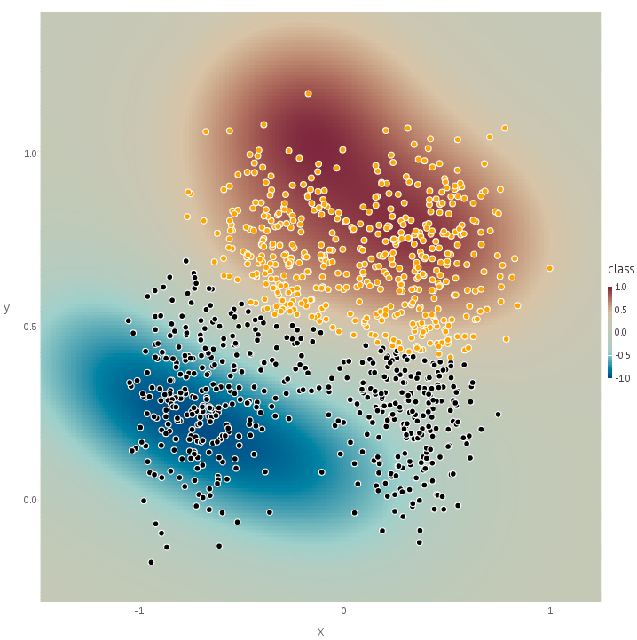
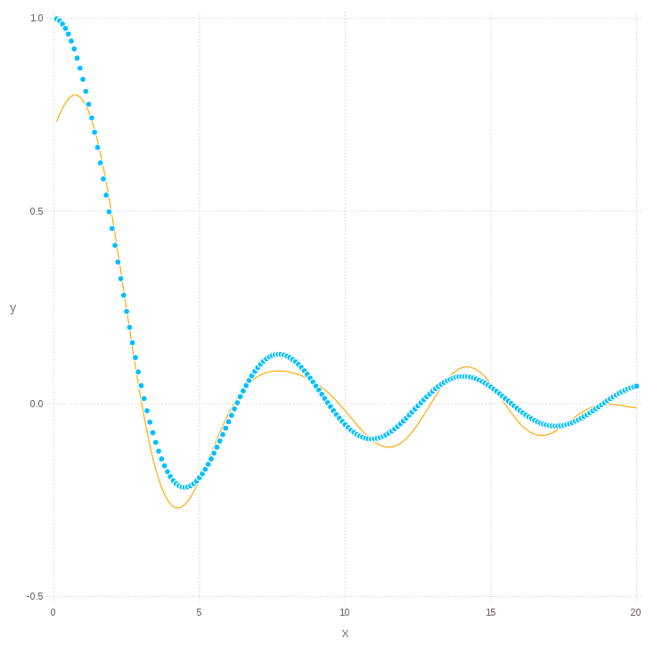

Examples & notebooks
=====================

Prerequisites
~~~~~~~~~~~~~~

Please refer to `Julia downloads <http://julialang.org/downloads>`_ page for installing **Julia** language and all dependencies. The instructions for installing the **SALSA** package can be found :ref:`here <installation>`. Some additional plotting and data management packages might be required to run examples below (like ``Gadfly``, ``MAT`` or ``DataFrames``). If you prefer Python-style notebooks please refer to the `Project Jupyter <http://jupyter.org>`_ and `IJulia <http://github.com/JuliaLang/IJulia.jl>`_ package for instructions. In this section we provide code snippets which can be easily copied into the **Julia** console or **Jupyter** notebook. 

Advanced Classification
~~~~~~~~~~~~~~~~~~~~~~~~

This example provides a use-case for nonlinear classification using :doc:`Nyström approximation <nystrom>` and Area Under `ROC <https://en.wikipedia.org/wiki/Receiver_operating_characteristic>`_ Curve (with 100 thresholds) as a cross-validation criterion.

.. code-block:: julia

   using SALSA, MAT

   ripley = matread(joinpath(Pkg.dir("SALSA"), "data", "ripley.mat")); srand(123);
   model = SALSAModel(NONLINEAR, PEGASOS(), LOGISTIC, validation_criterion=AUC(100));
   model = salsa(ripley["X"], ripley["Y"], model, ripley["Xt"]);

   range1 = linspace(-1.5,1.5,200);
   range2 = linspace(-0.5,1.5,200);
   grid = [[i j] for i in range1, j in range2];
   diff1 = range1[2] - range1[1];
   diff2 = range2[2] - range2[1];

   Xgrid = foldl(vcat, grid);
   Xtest = ripley["Xt"];

   yhat = model.output.Ytest;
   yplot = map_predict_latent(model,Xgrid);
   yplot = yplot - minimum(yplot);
   yplot = 2*(yplot ./ maximum(yplot)) - 1;
   
   using DataFrames
   df = DataFrame();
   df[:Xmin] = Xgrid[:,1][:];
   df[:Ymin] = Xgrid[:,2][:];
   df[:Xmax] = Xgrid[:,1][:] + diff1;
   df[:Ymax] = Xgrid[:,2][:] + diff2;
   df[:class] = yplot[:];

   using Gadfly
   set_default_plot_size(20cm, 20cm);
   plot(layer(x=Xtest[yhat.>0,1], y=Xtest[yhat.>0,2], Geom.point, Theme(default_color=colorant"orange")),
        layer(x=Xtest[yhat.<0,1], y=Xtest[yhat.<0,2], Geom.point, Theme(default_color=colorant"black")),
        layer(df, x_min="Xmin", x_max="Xmax", y_min="Ymin", y_max="Ymax", color="class", Geom.rectbin))
    

Advanced Regression
~~~~~~~~~~~~~~~~~~~~~~~~

This example provides a use-case for regression using :doc:`Nyström approximation <nystrom>` and :func:`mse` (Mean Squared Error) as a criterion in the `Leave-One-Out <https://en.wikipedia.org/wiki/Cross-validation_(statistics)>`_ cross-validation defined in `MLBase.jl <https://github.com/JuliaStats/MLBase.jl>`_ package.

.. code-block:: julia

   using SALSA, MLBase

   sinc(x) = sin(x)./x;
   X = linspace(0.1,20,100)'';
   Xtest = linspace(0.1,20,200)'';
   Y = sinc(X);
   srand(1234);

   model = SALSAModel(NONLINEAR, PEGASOS(), LEAST_SQUARES, 
    	cv_gen=Nullable{CrossValGenerator}(LOOCV(100)),
    	validation_criterion=MSE(), process_labels=false, subset_size=5.0);
   model = salsa(X, Y, model, Xtest);
    
   using Gadfly
   set_default_plot_size(20cm, 20cm);
   plot(layer(x=Xtest[:], y=sinc(Xtest), Geom.point),
        layer(x=Xtest[:], y=model.output.Ytest, Geom.line, Theme(default_color=colorant"orange")))
    
    

	
	